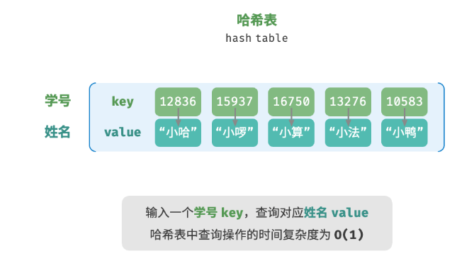

# 哈希表
哈希表（hash table），又称散列表，它通过建立键 key 与值 value 之间的映射，实现高效的元素查询。具体而言，我们向哈希表中输入一个键 key ，则可以在 O(1)时间内获取对应的值 value 。

如图 10-1 所示，给定 n 个学生，每个学生都有“姓名”和“学号”两项数据。假如我们希望实现“输入一个学号，返回对应的姓名”的查询功能，则可以采用图 10-1 所示的哈希表来实现。


## 哈希表常用操作
```
unordered_map<int,string>map;
map[12836]="xiaoming";
map[15937]="xiaohong";
map[10583]="xiaowang";
string name-map[15937];
map.erase(10583);

//遍历
//遍历键值对
for(auto kv:map){
    cout<<kv.first<<"->"<<kv.second<<end;
}
//使用迭代器
for(auto iter=map.begin();iter!=map.end();iter++)
{
    cout<<:iter->first<<"->"<<iter->second<<endl;
}
/*
这两种方法各有优缺点：

范围循环 更简洁，并且适合大多数场景，但你无法访问迭代器（如在遍历过程中删除元素）。
迭代器遍历 更灵活，允许你在遍历的同时进行更多操作，比如删除元素或修改遍历逻辑。
*/
```
## 哈希表的简单实现

## 哈希冲突与扩容（。。。）
从本质上看，哈希函数的作用是将所有 key 构成的输入空间映射到数组所有索引构成的输出空间，而输入空间往往远大于输出空间。因此，理论上一定存在“多个输入对应相同输出”的情况。
我们将这种多个输入对应同一输出的情况称为哈希冲突（hash collision）。
我们通过扩容哈希表减少哈希冲突。


似于数组扩容，哈希表扩容需将所有键值对从原哈希表迁移至新哈希表，非常耗时；并且由于哈希表容量 capacity 改变，我们需要通过哈希函数来重新计算所有键值对的存储位置，这进一步增加了扩容过程的计算开销。为此，编程语言通常会预留足够大的哈希表容量，防止频繁扩容。

负载因子（load factor）是哈希表的一个重要概念，其定义为哈希表的元素数量除以桶数量，用于衡量哈希冲突的严重程度，也常作为哈希表扩容的触发条件。例如在 Java 中，当负载因子超过 0.75 时，系统会将哈希表扩容至原先的 2 倍。