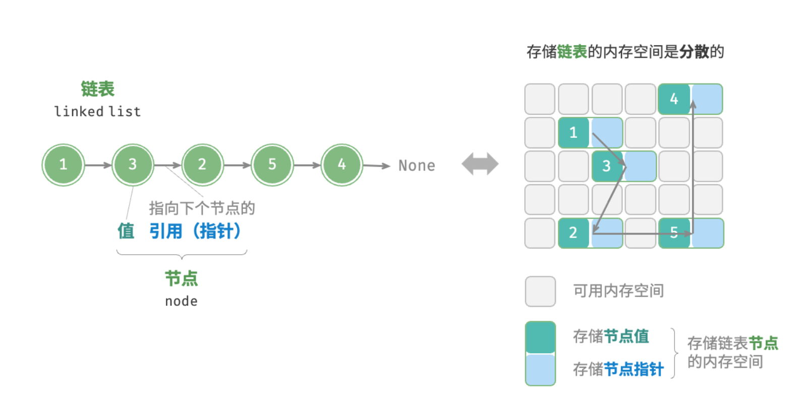
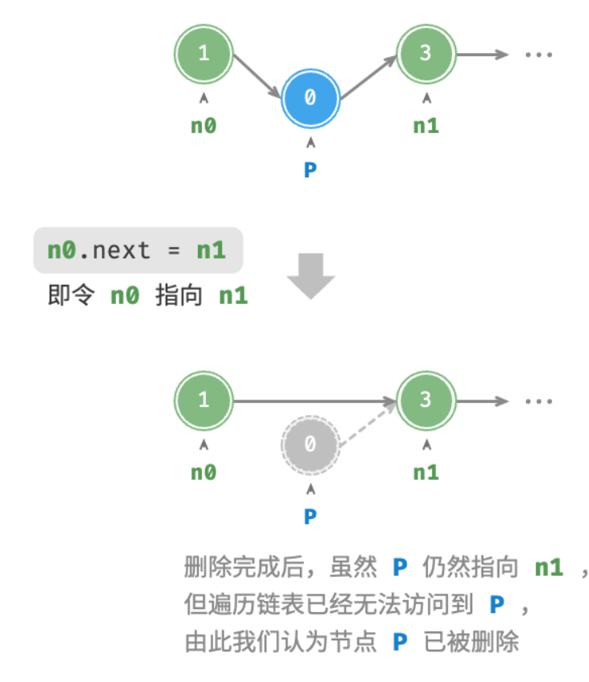
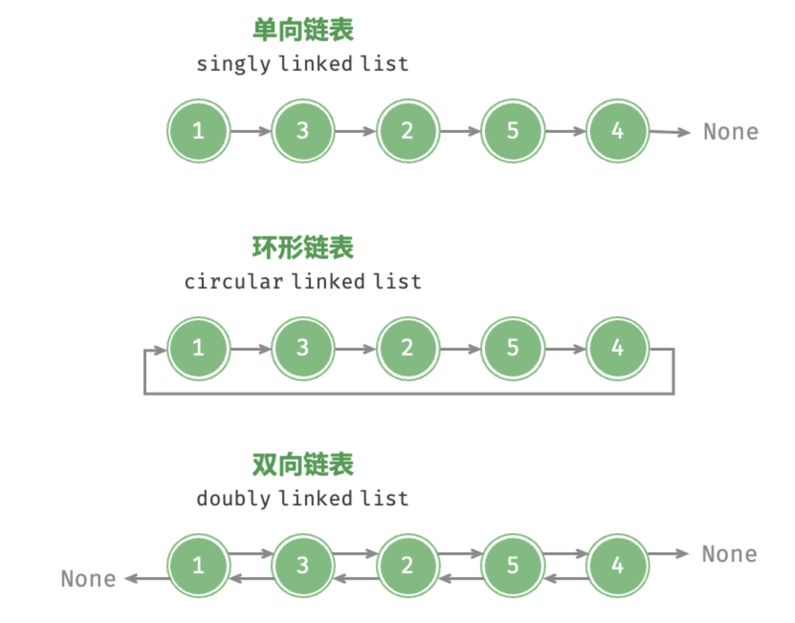

# 链表

## 链表基础
内存空间是所有程序的公共资源，在一个复杂的系统运行环境下，空闲的内存空间可能散落在内存各处。我们知道，存储数组的内存空间必须是连续的，而当数组非常大时，内存可能无法提供如此大的连续空间。此时链表的灵活性优势就体现出来了。

链表（linked list）是一种线性数据结构，其中的每个元素都是一个节点对象，各个节点通过“引用”相连接。引用记录了下一个节点的内存地址，通过它可以从当前节点访问到下一个节点。

链表的设计使得各个节点可以分散存储在内存各处，它们的内存地址无须连续。


观察图 5-1 ，链表的组成单位是节点（node）对象。每个节点都包含两项数据：节点的“值”和指向下一节点的“引用”。

- 链表的首个节点被称为“头节点”，最后一个节点被称为“尾节点”。
- 尾节点指向的是“空”，它在 C++ 和 Python 中分别被记为 nullptr 和 None 。
- 在 C、C++等支持指针的语言中，上述“引用”应被替换为“指针”。
```
# 9.py
class ListNode:
    def __init__(self,val:int) :
        self.val:int=val
        self.next:ListNode |None =None
```
```
//3.cpp
struct ListNode
{
    int val;
    ListNode *next;
    ListNode(int x):val(x),next(nullptr){}
};
```

## 链表的常用操作
#### 1.初始化链表
建立链表分为两步，第一步是初始化各个节点对象，第二步是构建节点之间的引用关系。

初始化完成后，我们就可以从链表的头节点出发，通过引用指向 next 依次访问所有节点。
```# 10.py
class ListNode:
    def __init__(self, val:int):
        self.val=val
        self.next=ListNode|None=None
n0=ListNode(1)
n1=ListNode(2)
n2=ListNode(3)
n3=ListNode(4)
n0.next=n1
n1.next=n2
n2.next=n3
```
```
//4.cpp
struct ListNode
{
    int val;
    ListNode *next;
    ListNode(int x):val(x),next(nullptr){}
};
ListNode *n0=new ListNode(1);
ListNode *n1=new ListNode(2);
ListNode *n2=new ListNode(3);
ListNode *n3=new ListNode(4);
n0->next=n1
n1->next=n2
n2->next=n3
```
数组整体是一个变量，比如数组 nums 包含元素 nums[0] 和 nums[1] 等，而链表是由多个独立的节点对象组成的。我们通常将头节点当作链表的代称，比如以上代码中的链表可记作链表 n0 。
#### 2.插入节点
在链表中插入节点非常容易。假设我们想在相邻的两个节点 n0 和 n1 之间插入一个新节点 P ，则只需改变两个节点引用（指针）即可，时间复杂度为 O(1).
#### 3.删除节点
在链表中删除节点也非常方便，只需改变一个节点的引用（指针）即可。
#### 4.访问节点
在链表中访问节点的效率较低。我们可以在 O(1)时间下访问数组中的任意元素。链表则不然，程序需要从头节点出发，逐个向后遍历，直至找到目标节点。也就是说，访问链表的第i个节点需要循环i-1轮，时间复杂度为 O(n)。
```
# 11.py
class ListNode:
    def __init__(self,val:int):
        self.val=val
        self.next=ListNode | None = None
# 访问index的节点
def access(head:ListNode,index:int)->ListNode|None:
    for _ in range(index):
        if not head:
            return None
        head=head.next
    return head
```
```
// 5.cpp
struct ListNode
{
    int val;
    ListNode *next;
    ListNode(int x):val(x),next(nullptr){}
};
ListNode *access(ListNode *head,int index)
{
    for(int i=0;i<index;i++)
    {
        if(head=nullptr)   return nullptr;
        head=head->next;
    }
    return head;
}
```
#### 5.查找节点
遍历链表，查找其中值为 target 的节点，输出该节点在链表中的索引。此过程也属于线性查找。

## 链表常见类型
常见的链表类型包括三种：

- **单向链表：** 即前面介绍的普通链表。单向链表的节点包含值和指向下一节点的引用两项数据。我们将首个节点称为头节点，将最后一个节点称为尾节点，尾节点指向空 None 。
- **环形链表：** 如果我们令单向链表的尾节点指向头节点（首尾相接），则得到一个环形链表。在环形链表中，任意节点都可以视作头节点。
- **双向链表：** 与单向链表相比，双向链表记录了两个方向的引用。双向链表的节点定义同时包含指向后继节点（下一个节点）和前驱节点（上一个节点）的引用（指针）。相较于单向链表，双向链表更具灵活性，可以朝两个方向遍历链表，但相应地也需要占用更多的内存空间。


## 链表的应用
单向链表通常用于实现栈、队列、哈希表和图等数据结构。

- 栈与队列：当插入和删除操作都在链表的一端进行时，它表现的特性为先进后出，对应栈；当插入操作在链表的一端进行，删除操作在链表的另一端进行，它表现的特性为先进先出，对应队列。
- 哈希表：链式地址是解决哈希冲突的主流方案之一，在该方案中，所有冲突的元素都会被放到一个链表中。
- 图：邻接表是表示图的一种常用方式，其中图的每个顶点都与一个链表相关联，链表中的每个元素都代表与该顶点相连的其他顶点。

双向链表常用于需要快速查找前一个和后一个元素的场景。

- 高级数据结构：比如在红黑树、B 树中，我们需要访问节点的父节点，这可以通过在节点中保存一个指向父节点的引用来实现，类似于双向链表。
- 浏览器历史：在网页浏览器中，当用户点击前进或后退按钮时，浏览器需要知道用户访问过的前一个和后一个网页。双向链表的特性使得这种操作变得简单。
- LRU 算法：在缓存淘汰（LRU）算法中，我们需要快速找到最近最少使用的数据，以及支持快速添加和删除节点。这时候使用双向链表就非常合适。

环形链表常用于需要周期性操作的场景，比如操作系统的资源调度。

- 时间片轮转调度算法：在操作系统中，时间片轮转调度算法是一种常见的 CPU 调度算法，它需要对一组进程进行循环。每个进程被赋予一个时间片，当时间片用完时，CPU 将切换到下一个进程。这种循环操作可以通过环形链表来实现。
- 数据缓冲区：在某些数据缓冲区的实现中，也可能会使用环形链表。比如在音频、视频播放器中，数据流可能会被分成多个缓冲块并放入一个环形链表，以便实现无缝播放。