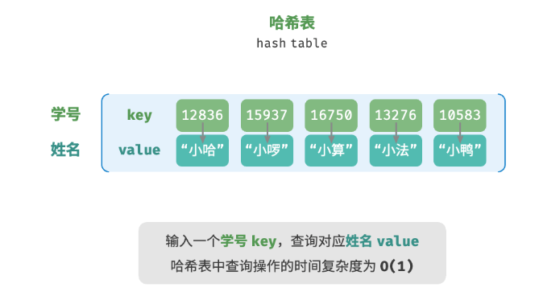

# 哈希表
哈希表（hash table），又称散列表，它通过建立键 key 与值 value 之间的映射，实现高效的元素查询。具体而言，我们向哈希表中输入一个键 key ，则可以在 O(1)时间内获取对应的值 value 。

如图 10-1 所示，给定 n 个学生，每个学生都有“姓名”和“学号”两项数据。假如我们希望实现“输入一个学号，返回对应的姓名”的查询功能，则可以采用图 10-1 所示的哈希表来实现。
