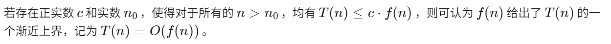
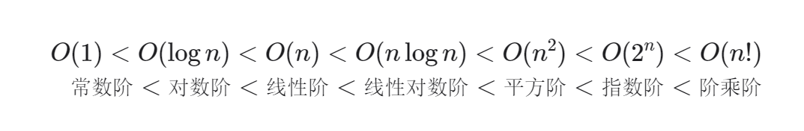
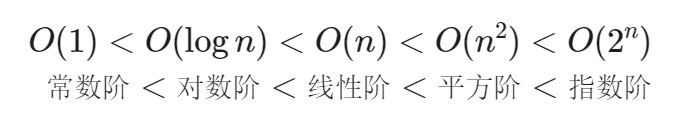

# <center><font face="楷体" size=10>认识算法</font></center>

## 一、算法效率评估
在能够解决问题的前提下我们希望找到更高效的算法，因此有效地评估算法效率至关重要，因为只有这样，我们才能将各种算法进行对比，进而指导算法设计与优化过程。

效率评估方法主要分为两种：
- 实际测试
- 理论估算
  
由于实际测试具有较大的局限性，因此我们可以考虑仅通过一些计算来评估算法的效率。这种估算方法就是复杂度分析。

复杂度分析能够体现算法运行所需的时间和空间资源与输入数据大小之间的关系。它描述了**随着输入数据大小的增加，算法执行所需时间和空间的增长趋势**。

理解：
- “时间和空间资源”分别对应时间复杂度（time complexity）和空间复杂度（space complexity）。
- “随着输入数据大小的增加”意味着复杂度反映了算法运行效率与输入数据体量之间的关系。
- “时间和空间的增长趋势”表示复杂度分析关注的不是运行时间或占用空间的具体值，而是时间或空间增长的“快慢”。
  
## 二、程序如何实现重复执行任务：迭代、递归。
#### 迭代
迭代是一种重复执行某个任务的控制结构。在迭代中，程序会在满足一定的条件下重复执行某段代码，直到这个条件不再满足。
例如求1+2+3+...+n（for循环）
```
# 1.py
n=int(input("Enter n\n20"))
num=0
for i in range(1,n+1):
    num+=i
print(num)
```
（while循环）
```
# 2.py
n=int(input("Enter n\n"))
i=1
sum=0
while i<=n:
    sum+=i
    i+=1
print(sum)
```
while 循环比 for 循环的自由度更高。在 while 循环中，我们可以自由地设计条件变量的初始化和更新步骤。
#### 递归
递归是一种算法策略，通过函数调用自身来解决问题。它主要包含两个阶段。

- 递：程序不断深入地调用自身，通常传入更小或更简化的参数，直到达到“终止条件”。
- 归：触发“终止条件”后，程序从最深层的递归函数开始逐层返回，汇聚每一层的结果。

而从实现的角度看，递归代码主要包含三个要素。
- 终止条件：用于决定什么时候由“递”转“归”。
- 递归调用：对应“递”，函数调用自身，通常输入更小或更简化的参数。
- 返回结果：对应“归”，将当前递归层级的结果返回至上一层。
```
# 3.py
def sum(n:int)->int:
    if n==1:
        return 1
    else:
        return n+sum(n-1)
    
n=int(input("Enter n\n"))
print(sum(n))
```
虽然从计算角度看，迭代与递归可以得到相同的结果，但它们代表了两种完全不同的思考和解决问题的范式。

- 迭代：“自下而上”地解决问题。从最基础的步骤开始，然后不断重复或累加这些步骤，直到任务完成。
- 递归：“自上而下”地解决问题。将原问题分解为更小的子问题，这些子问题和原问题具有相同的形式。接下来将子问题继续分解为更小的子问题，直到基本情况时停止（基本情况的解是已知的）。
  
#### 调用栈
递归函数每次调用自身时，系统都会为新开启的函数分配内存，以存储局部变量、调用地址和其他信息等。这将导致两方面的结果。

函数的上下文数据都存储在称为“栈帧空间”的内存区域中，直至函数返回后才会被释放。因此，递归通常比迭代更加耗费内存空间。

递归调用函数会产生额外的开销。因此递归通常比循环的时间效率更低。

在实际中，编程语言允许的递归深度通常是有限的，过深的递归可能导致栈溢出错误。
#### 尾递归
如果函数在返回前的最后一步才进行递归调用，则该函数可以被编译器或解释器优化，使其在空间效率上与迭代相当。这种情况被称为尾递归。
#### 递归树
当处理与“分治”相关的算法问题时，递归往往比迭代的思路更加直观、代码更加易读。
```
# 4.py
def fib(n:int)->int:
    if  n==1 or n==2:
        return 1
    else:
        return fib(n-1)+fib(n-2)
    
n=int(input("Enter n\n"))
print(fib(n))
```
## 三、时间复杂度
时间复杂度分析统计的不是算法运行时间，而是算法运行时间随着数据量变大时的增长趋势。

<u>时间复杂度分析有哪些特点呢？</u>

- 时间复杂度能够有效评估算法效率。
- 时间复杂度的推算方法更简便。显然，运行平台和计算操作类型都与算法运行时间的增长趋势无关。因此在时间复杂度分析中，我们可以简单地将所有计算操作的执行时间视为相同的“单位时间”，从而将“计算操作运行时间统计”简化为“计算操作数量统计”，这样一来估算难度就大大降低了。
- 时间复杂度也存在一定的局限性。

#### 函数渐进上界
时间复杂度分析本质上是计算“操作数量T(n)”的渐近上界，它具有明确的数学定义。



#### 推算方法
**第一步：统计操作数量:**
- 1.忽略 T(n)中的常数项。因为它们都与n无关，所以对时间复杂度不产生影响。
- 省略所有系数。例如，循环2n次、可以简化记为n次，因为n前面的系数对时间复杂度没有影响。
- 循环嵌套时使用乘法。总操作数量等于外层循环和内层循环操作数量之积，每一层循环依然可以分别套用第1点和第2点的技巧。

**第二步：判断渐近上界**
时间复杂度由T(n)中最高阶的项来决定。这是因为在n趋于无穷大时，最高阶的项将发挥主导作用，其他项的影响都可以忽略。

**常见类型**


#### 总结
算法的时间效率往往不是固定的，而是与输入数据的分布有关。

同时，我们在实际中很少使用最佳时间复杂度，因为通常只有在很小概率下才能达到，可能会带来一定的误导性。而最差时间复杂度更为实用，因为它给出了一个效率安全值，让我们可以放心地使用算法。

## 四、空间复杂度
空间复杂度用于衡量算法占用内存空间随着数据量变大时的增长趋势。这个概念与时间复杂度非常类似，只需将“运行时间”替换为“占用内存空间”。

算法在运行过程中使用的内存空间主要包括以下几种。
- 输入空间：用于存储算法的输入数据。
- 暂存空间：用于存储算法在运行过程中的变量、对象、函数上下文等数据。
- 输出空间：用于存储算法的输出数据。一般情况下，空间复杂度的统计范围是“暂存空间”加上“输出空间”。

暂存空间可以进一步划分为三个部分。

- 暂存数据：用于保存算法运行过程中的各种常量、变量、对象等。
- 栈帧空间：用于保存调用函数的上下文数据。系统在每次调用函数时都会在栈顶部创建一个栈帧，函数返回后，栈帧空间会被释放。
- 指令空间：用于保存编译后的程序指令，在实际统计中通常忽略不计。

在分析一段程序的空间复杂度时，我们通常统计暂存数据、栈帧空间和输出数据三部分。

空间复杂度的推算方法与时间复杂度大致相同，只需将统计对象从“操作数量”转为“使用空间大小”。

而与时间复杂度不同的是，我们通常只关注最差空间复杂度。这是因为内存空间是一项硬性要求，我们必须确保在所有输入数据下都有足够的内存空间预留。
#### 常见类型


第二章内容理论较多，比较晦涩难懂，不要求全部理解，在以后的章节里带入可以加深理解。