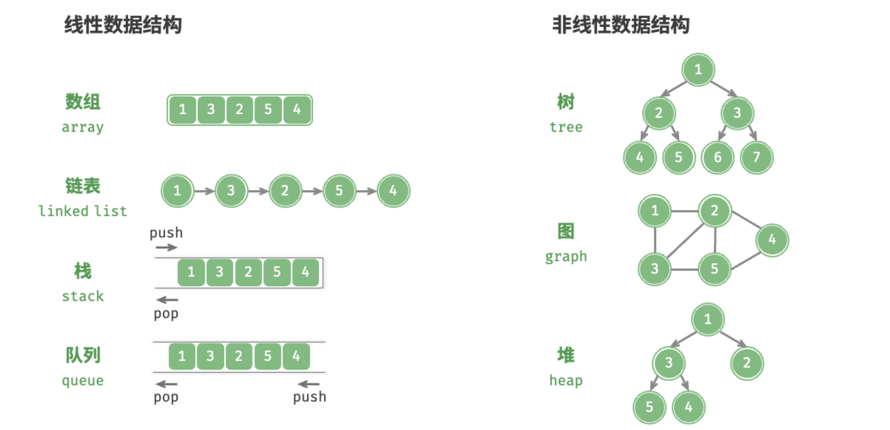
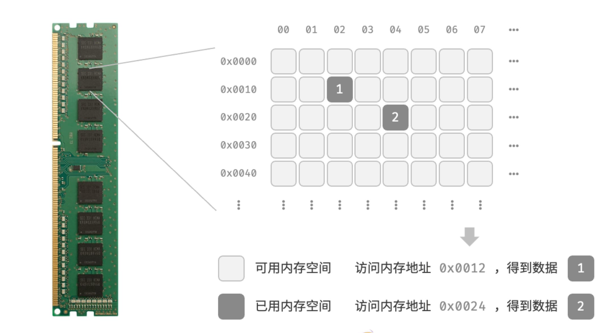
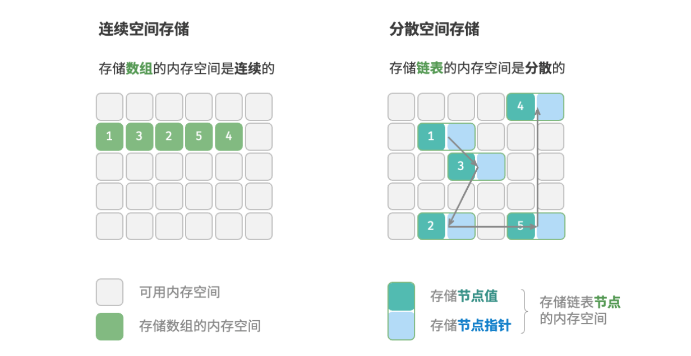

# 
数据结构

常见的数据结构包括数组、链表、栈、队列、哈希表、树、堆、图，它们可以从“逻辑结构”和“物理结构”两个维度进行分类。
## 数据结构分类
### 逻辑结构：线性与非线性
逻辑结构揭示了数据元素之间的逻辑关系。在数组和链表中，数据按照一定顺序排列，体现了数据之间的线性关系；而在树中，数据从顶部向下按层次排列，表现出“祖先”与“后代”之间的派生关系；图则由节点和边构成，反映了复杂的网络关系。

线性数据结构：
- 数组、链表、栈、队列、哈希表，元素之间是一对一的顺序关系。
- 非线性数据结构：树、堆、图、哈希表。

非线性数据结构可以进一步划分为树形结构和网状结构。
- 树形结构：树、堆、哈希表，元素之间是一对多的关系。
- 网状结构：图，元素之间是多对多的关系。
- 
  
### 物理结构
当算法程序运行时，正在处理的数据主要存储在内存中。图 3-2 展示了一个计算机内存条，其中每个黑色方块都包含一块内存空间。我们可以将内存想象成一个巨大的 Excel 表格，其中每个单元格都可以存储一定大小的数据。

系统通过内存地址来访问目标位置的数据。如图 3-2 所示，计算机根据特定规则为表格中的每个单元格分配编号，确保每个内存空间都有唯一的内存地址。有了这些地址，程序便可以访问内存中的数据。

内存是所有程序的共享资源，当某块内存被某个程序占用时，则通常无法被其他程序同时使用了。因此在数据结构与算法的设计中，内存资源是一个重要的考虑因素。比如，算法所占用的内存峰值不应超过系统剩余空闲内存；如果缺少连续大块的内存空间，那么所选用的数据结构必须能够存储在分散的内存空间内。

物理结构反映了数据在计算机内存中的存储方式，可分为连续空间存储（数组）和分散空间存储（链表）。物理结构从底层决定了数据的访问、更新、增删等操作方法，两种物理结构在时间效率和空间效率方面呈现出互补的特点

所有数据结构都是基于数组、链表或二者的组合实现的。例如，栈和队列既可以使用数组实现，也可以使用链表实现；而哈希表的实现可能同时包含数组和链表。
- 基于数组可实现：栈、队列、哈希表、树、堆、图、矩阵、张量（维度 
 的数组）等。
- 基于链表可实现：栈、队列、哈希表、树、堆、图等。
  
链表在初始化后，仍可以在程序运行过程中对其长度进行调整，因此也称“动态数据结构”。数组在初始化后长度不可变，因此也称“静态数据结构”。值得注意的是，数组可通过重新分配内存实现长度变化，从而具备一定的“动态性”。

# 数字编码与字符编码
数字编码参考原码补码反码，此处省略

### 字符编码
#### 1、ASCII码，此处省略
#### 2、Unicode 字符集
研究人员就在想：如果推出一个足够完整的字符集，将世界范围内的所有语言和符号都收录其中，不就可以解决跨语言环境和乱码问题了吗？在这种想法的驱动下，一个大而全的字符集 Unicode 应运而生。

#### 3、UTF-8 编码
目前，UTF-8 已成为国际上使用最广泛的 Unicode 编码方法。它是一种可变长度的编码，使用 1 到 4 字节来表示一个字符，根据字符的复杂性而变。ASCII 字符只需 1 字节，拉丁字母和希腊字母需要 2 字节，常用的中文字符需要 3 字节，其他的一些生僻字符需要 4 字节。

UTF-8 的编码规则并不复杂，分为以下两种情况。

- 对于长度为 1 字节的字符，将最高位设置为0，其余 7 位设置为 Unicode 码点。值得注意的是，ASCII 字符在 Unicode 字符集中占据了前 128 个码点。也就是说，UTF-8 编码可以向下兼容 ASCII 码。这意味着我们可以使用 UTF-8 来解析年代久远的 ASCII 码文本。
- 对于长度为 n字节的字符（其中 n>1），将首个字节的高n位都设置为 1，第 n+1位设置为0；从第二个字节开始，将每个字节的高 2 位都设置为 10；其余所有位用于填充字符的 Unicode 码点。

