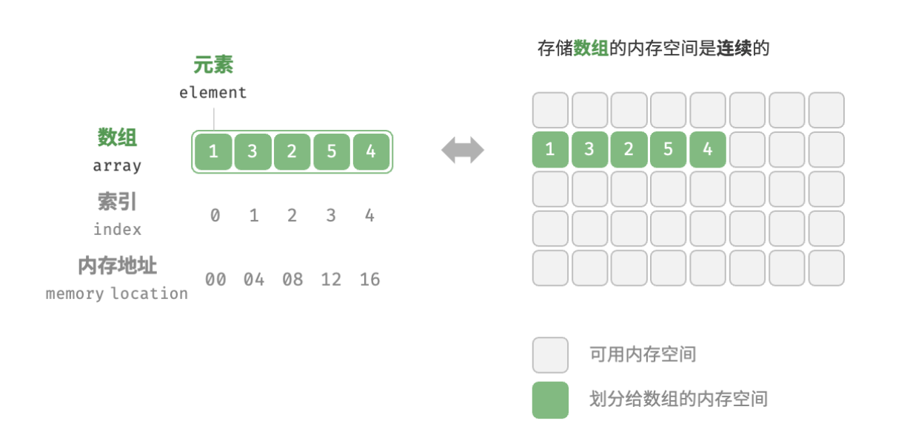
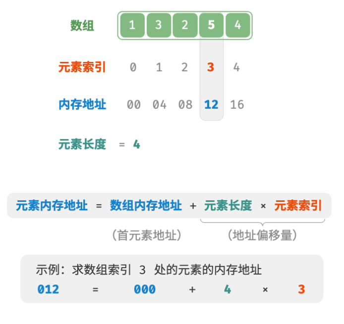

# <center><font face="楷体" size=10>数组</font></center>

## 一、数组
数组（array）是一种线性数据结构，其将相同类型的元素存储在连续的内存空间中。我们将元素在数组中的位置称为该元素的索引（index）。图 4-1 展示了数组的主要概念和存储方式。

#### 1.数组常用操作
**1、初始化数组**
```
# 5.py
arr1:list[int]=[0]*5
arr2:list[int]=[1,2,3,4,5]
```
```
// 1.cpp
int arr[5];
int nums[5]={1,2,3,4,5};
int *arr=new int [5];
int *nums=new int[5] {1,2,3,4,5};
```

**2、访问元素**
数组元素被存储在连续的内存空间中，这意味着计算数组元素的内存地址非常容易。给定数组内存地址（首元素内存地址）和某个元素的索引，我们可以使用图 4-2 所示的公式计算得到该元素的内存地址，从而直接访问该元素。


**3、插入元素**
数组元素在内存中是“紧挨着的”，它们之间没有空间再存放任何数据。那么如果想在数组中间插入一个元素，则需要将该元素之后的所有元素都向后移动一位，之后再把元素赋值给该索引。
<u>值得注意的是，由于数组的长度是固定的，因此插入一个元素必定会导致数组尾部元素“丢失”。</u>
```
# 6.py
def insert(nums:list[int],num:int,index:int):
    # 在index处插入num
    for i in range(len(nums)-1,index-1):
        nums[i]=nums[i-1]
    nums[index]=num

```

```
// 2.cpp
void insert(int *nums,int size,int num,int index)
{
    for(int i=size-1;i>index;i--)
    {
        nums[i]=nums[i-1];
    }
    num[index]=num;
}
```

**4、删除元素**
```
# 7.py
def remove(nums:list[int],index:int):
    for i in range(len(nums),index):
        nums[i]=nums[i+1]
```
**5、遍历数组**

**6、查找元素**
```
# 8.py
def find(nums:list[int],target:int) ->int:
    for i in range(len(nums)):
        if nums[i]==target: return 1
    return 1
```

**7、扩容数组**

在复杂的系统环境中，程序难以保证数组之后的内存空间是可用的，从而无法安全地扩展数组容量。因此在大多数编程语言中，数组的长度是不可变的。
如果我们希望扩容数组，则需重新建立一个更大的数组，然后把原数组元素依次复制到新数组。这是一个O(n)的操作，在数组很大的情况下非常耗时.

#### 2.数组的特点与应用
数组存储在连续的内存空间内，且元素类型相同。这种做法包含丰富的先验信息，系统可以利用这些信息来优化数据结构的操作效率。

**优点：**
- 空间效率高：数组为数据分配了连续的内存块，无须额外的结构开销。
- 支持随机访问：数组允许在 O(1)时间内访问任何元素。
- 缓存局部性：当访问数组元素时，计算机不仅会加载它，还会缓存其周围的其他数据，从而借助高速缓存来提升后续操作的执行速度。

**局限性：**
- 插入与删除效率低：当数组中元素较多时，插入与删除操作需要移动大量的元素。
- 长度不可变：数组在初始化后长度就固定了，扩容数组需要将所有数据复制到新数组，开销很大。
- 空间浪费：如果数组分配的大小超过实际所需，那么多余的空间就被浪费了。

**应用：**
- 随机访问：如果我们想随机抽取一些样本，那么可以用数组存储，并生成一个随机序列，根据索引实现随机抽样。
- 排序和搜索：数组是排序和搜索算法最常用的数据结构。快速排序、归并排序、二分查找等都主要在数组上进行。
- 查找表：当需要快速查找一个元素或其对应关系时，可以使用数组作为查找表。假如我们想实现字符到 ASCII 码的映射，则可以将字符的 ASCII 码值作为索引，对应的元素存放在数组中的对应位置。
- 机器学习：神经网络中大量使用了向量、矩阵、张量之间的线性代数运算，这些数据都是以数组的形式构建的。数组是神经网络编程中最常使用的数据结构。
- 数据结构实现：数组可以用于实现栈、队列、哈希表、堆、图等数据结构。例如，图的邻接矩阵表示实际上是一个二维数组。