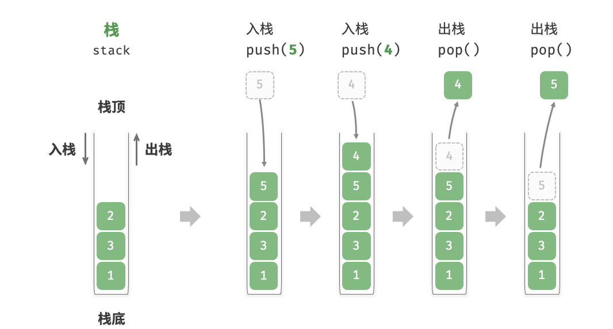
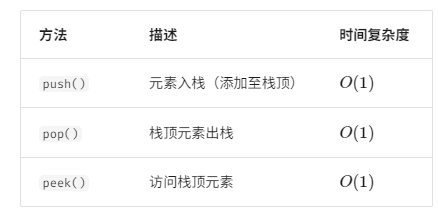

# 栈
## 栈的基本概念
栈（stack）是一种遵循先入后出逻辑的线性数据结构。

我们可以将栈类比为桌面上的一摞盘子，如果想取出底部的盘子，则需要先将上面的盘子依次移走。我们将盘子替换为各种类型的元素（如整数、字符、对象等），就得到了栈这种数据结构。

如图 8-1 所示，我们把堆叠元素的顶部称为“栈顶”，底部称为“栈底”。将把元素添加到栈顶的操作叫作“入栈”，删除栈顶元素的操作叫作“出栈”。


## 栈的常用操作

下面我们看在python和c++中上面操作是如何具体实现的。
```
# 15.py
stack:list[int]=[]
# 元素入栈
stack.append(1)
stack.append(2)

# 访问栈顶元素
peek:int=stack[-1]

# 元素出栈
pop:int=stack.pop()

# 获取栈的长度
size:int=len(stack)

# 判断是否为空
is_empty:bool=len(stack)==0
```
```
// 8.cpp
#include<stack>
stack<int> stack;
stack.push(1);
stack.push(2);
int top=stack.pop();
int size=stack.size();
bool empty=stack.empty();
```

## 栈的实现
（。。。）

## 栈的典型应用
- **浏览器中的后退与前进、软件中的撤销与反撤销** 。每当我们打开新的网页，浏览器就会对上一个网页执行入栈，这样我们就可以通过后退操作回到上一个网页。后退操作实际上是在执行出栈。如果要同时支持后退和前进，那么需要两个栈来配合实现。
- **程序内存管理** 。每次调用函数时，系统都会在栈顶添加一个栈帧，用于记录函数的上下文信息。在递归函数中，向下递推阶段会不断执行入栈操作，而向上回溯阶段则会不断执行出栈操作。