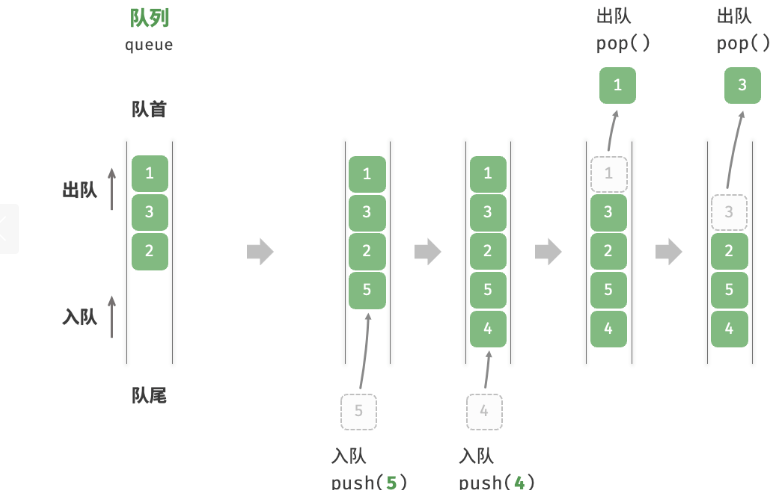
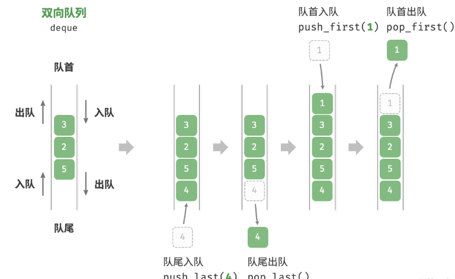

# 队列
队列（queue）是一种遵循先入先出规则的线性数据结构。顾名思义，队列模拟了排队现象，即新来的人不断加入队列尾部，而位于队列头部的人逐个离开。


## 队列常用操作
```
queue<int> queue;
//元素入队
queue.push(1);
queue.push(2);
//访问队首元素
int front = queue.front();
//元素出队
queue.pop();
//获取队列长度
int size =queue.size();
//判断队列是否为空
bool empty=queue.empty();
```

## 队列的实现

## 队列的应用
- **淘宝订单** 。购物者下单后，订单将加入队列中，系统随后会根据顺序处理队列中的订单。在双十一期间，短时间内会产生海量订单，高并发成为工程师们需要重点攻克的问题。
- **各类待办事项** 。任何需要实现“先来后到”功能的场景，例如打印机的任务队列、餐厅的出餐队列等，队列在这些场景中可以有效地维护处理顺序。

## 双向队列
在队列中，我们仅能删除头部元素或在尾部添加元素。如图 9-2 所示，双向队列（double-ended queue）提供了更高的灵活性，允许在头部和尾部执行元素的添加或删除操作。


## 双向队列常用操作
```
deque<int> deque;
deque.push_back(1);
deque.push_front(2);
int front=deque.front();
int back=deque.back();
deque.pop _front();
deque.pop_back();
int size=deque.size();
bool empty=deque.empty();
```

## 双向队列的实现
（。。。）

## 双向队列的应用
双向队列兼具栈与队列的逻辑，因此它可以实现这两者的所有应用场景，同时提供更高的自由度。

我们知道，软件的“撤销”功能通常使用栈来实现：系统将每次更改操作 push 到栈中，然后通过 pop 实现撤销。然而，考虑到系统资源的限制，软件通常会限制撤销的步数（例如仅允许保存 50步）。当栈的长度超过 50 时，软件需要在栈底（队首）执行删除操作。但栈无法实现该功能，此时就需要使用双向队列来替代栈。请注意，“撤销”的核心逻辑仍然遵循栈的先入后出原则，只是双向队列能够更加灵活地实现一些额外逻辑。

## 总结归纳
- 栈是一种遵循先入后出原则的数据结构，可通过数组或链表来实现。
在时间效率方面，栈的数组实现具有较高的平均效率，但在扩容过程中，单次入栈操作的时间复杂度会劣化至 O(n)。相比之下，栈的链表实现具有更为稳定的效率表现。
- 在空间效率方面，栈的数组实现可能导致一定程度的空间浪费。但需要注意的是，链表节点所占用的内存空间比数组元素更大。
- 队列是一种遵循先入先出原则的数据结构，同样可以通过数组或链表来实现。在时间效率和空间效率的对比上，队列的结论与前述栈的结论相似。
- 双向队列是一种具有更高自由度的队列，它允许在两端进行元素的添加和删除操作。